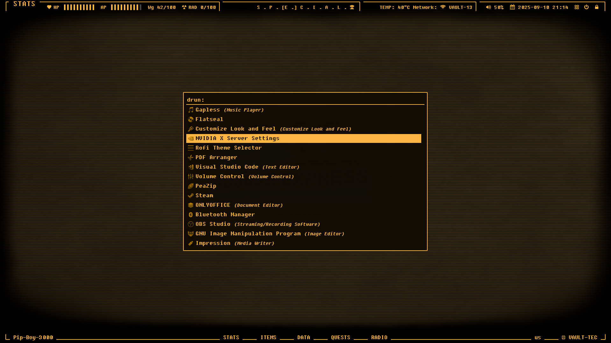

# Pip-Boy-i3 | Window Manger in Wasteland

> This setup made within Debian 13 + i3wm @1920x1080 21" display for 2k, 4k you might need to adjust to match your screen, Also this project is a personal config for my Desktop PC that run x11 + Nvidia Driver So it's also can Games


I also have Sway/Wayland spin! [Pip-Boy-Sway](https://github.com/Tong-ST/pip-boy-sway)
## BEFORE INSTALL

NOTE: If you new to i3 / Don't has much experience on config stuff, Recommend you see my guide on how I [setup debian with i3](https://github.com/Tong-ST/debian_i3/) (I build this theme on top of that setup, So is also good reference)

Package you may need to make it functional with my setup. (I will assume you already setup debian + i3 correctly and ready to use)
```
sudo apt install polybar alacritty picom rofi alacritty fastfetch feh thunar lxappearance maim xclip fonts-font-awesome
```
Optional, Bucklespring for keyboard sound effect that feel more nostalgia
```
sudo apt install bucklespring
```
if Not install Disable startup in i3 .config

## SETUP MAIN CONFIG
1. Git clone if not already
    ```
    git clone https://github.com/Tong-ST/pip-boy-i3.git 
    cd pip-boy-i3
    ```
2. Copy .config file or Manually copy files in configs folder to ~/.config/
    ```
    cp -r config_files/i3/ ~/.config/ 
    cp -r config_files/polybar/ ~/.config/
    ```
3. Install Required Fonts
    ```
    mkdir ~/.local/share/fonts
    cp assets/fonts/FSEX300.ttf ~/.local/share/fonts
    ```
    ```
    wget -P ~/.local/share/fonts https://github.com/ryanoasis/nerd-fonts/releases/download/v3.0.2/JetBrainsMono.zip
    cd ~/.local/share/fonts
    unzip JetBrainsMono.zip
    rm JetBrainsMono.zip
    fc-cache -fv
    ```
4. Setup Wallpapers
    ```
    cp assets/wallpapers/example_wall/* ~/.config/i3/wallpapers/
    ```

    At this step let's see i3 + polybar work together correctly. by Logout and Login back if you see polybar appear and i3 doesn't prompt an error your good to go..

4. More .config files
    
    
    
    And in git folder `cd pip-boy-i3`
    ```
    cp -r config_files/alacritty/ ~/.config/ 
    cp -r config_files/rofi/ ~/.config/
    cp -r config_files/picom/ ~/.config/
    cp -r config_files/fastfetch/ ~/.config/
    ```

    Also for `rofi` You should copy my theme to main rofi theme as well so you can select via rofi theme selector
    ```
    sudo cp config_files/rofi/Pip-Boy-Amber.rasi /usr/share/rofi/themes/
    ```
    OR link rofi .rasi file, So if you edit it will effect both
    ```
    sudo ln -sf ~/.config/rofi/Pip-Boy-Amber.rasi /usr/share/rofi/themes/Pip-Boy-Amber.rasi
    ```

5. Check all .config files working correctly
    - Check i3 config, I have 4 files total in i3 config, That you should read and adjust to your setup `cd ~/.config/i3/`
        - especially in `workspace.conf` You should Adjust **MONITOR NAME** right now in setup is 2-Monitor name HDMI-0 / DVI-D-0, Use `xrandr` command to see name of your output
    - Check Polybar .config Those has 3 files total, Also custom script for `workspaces.sh` You should update workspace Icons as you need,
        - I haven't study Bash yet, workspaces.sh script here it from my ChatGPT mate, As I understand i3 doesn't has a way to show empty workspace, So custom script might needed here
    
## FINISHING TOUCH
1. Setup GTK Themes, Icons, Cursor You can use different themes here, I just recommend some that i used

- For matching theme i use [Sunrise-Dark](https://www.pling.com/p/1258305/) as you can see in Thunar   
- For Icons I use [Besgnulinux Monochrome Orange](https://www.pling.com/p/2151189) to match basic orange Icons
- For cursor I use [Bibata Cursor Translucent](www.pling.com/p/1437885/) That's really like Fallout New Vegas Cursor

- All, Those you can use `lxappearance` to manage But it kinda restrict for GTK3-Themes, So for GTK4, You might manually update `settings.ini` or link GTK3 setting to GTK4 by
    ```
    mkdir -p ~/.config/gtk-4.0
    ln -sf ~/.config/gtk-3.0/settings.ini ~/.config/gtk-4.0/settings.ini
    ```
    Assuming `~/.config/gtk-3.0/settings.ini` already exist by you update some theme with lxappearance, This way Your, GTK3/4 app will respect your setting
- If using `flakpak` apps you might run into those app doesn't apply your system-wide theme/fonts/icons/etc. cause flatpak is sandbox
    - To make it respect you themes you can use app like `flatseal` that in manage permission per app in flatpak
    - In Flatseal app Go to `Filesystem` section and add `xdg-config/gtk-4.0:ro` and `xdg-config/gtk-3.0:ro`, Now that app will read from your GTK settings.ini
    - use `gsettings set org.gnome.desktop.interface color-scheme prefer-dark` to set system-wide app prefer dark themes
    - So my flatseal global look something like this:
    
    - Or you can override flatpak permission by command-line Don't need flatseal app, Just google to see how-to

- Additional Update [CRT-Amber GRUB Theme](https://www.pling.com/p/1727268/) That's fallout terminal right there!

2. Setup Firefox

- install Firefox from `Flatpak` you'll get newer version will have Vertical Bar, built-in, Also Use Extension call `Firefox Color` And use this [PresetColor](https://color.firefox.com/?theme=XQAAAAIkAQAAAAAAAABBqYhm849SCia2CaaEGccwS-xMDPr_qlW0-ZoUDfx_5PxF1taykGHQpXYV0WBCSeAgtCZEAUZpNSdEGTCaC8UdrIaq6O9seZMIjd0Gx4sgZ9gY3sk4n7hYuWoIw7cgx-PBcrU5Q72E9FCeFIYvPTIysUjTWE48iAZC4eZSAIrf69jrnrBSvcWoP5bT8PAntIAfZ93gcK6lZCgPp0__cS-hcYY5Ec3DAFHXosQXQDVZ_1sUgAA) That I Theming to match my setup
- You also can use extension like `Tabliss` to display you wallpaper like mine

## THAT'S IT!
Enjoy your like in Wasteland!

- Due to some limitation with Polybar, I Have to use some kind of Image editor, Add effect like `Vignette` to make it blend with setup, So, If you use you own wallpaper You may have to edited img with `Gimp` First gimp file available at `assets/wallpapers/Pip_wall_creator.xcf` Should be in Git folder You can just Add your image and leave `Vignette` Effect visible, That should be good


- Color Ref.


- My Default Key-Binding
    - ``` WIN+SHIFT+E ``` = logout
    - ``` WIN+SHIFT+W ``` = Close window/application
    - ``` WIN+SHIFT+C ``` = Reload i3 config file to see changes (Error might show, better fix what's wrong before move on)
    - ``` WIN+D ``` = Search for app using rofi
    - ``` WIN+ENTER ``` = Open alacritty terminal
    - ``` WIN+Z ``` = Open your browser default with Firefox

## BUG SECTION!
- Polybar Button Click might be hard to click Due to some limitation of Polybar/i3 that i have to add some space margin that overlap about half button height, This the best i can do for now to match between style that to going for / Usability

## THANKS & SUPPORT
- [Sunrise-Dark](https://www.pling.com/p/1258305/) Awesome GTK Themes
- [Bibata Cursor Translucent](www.pling.com/p/1437885/) That's really like Fallout New Vegas Cursor
- [CRT-Amber GRUB Theme](https://www.pling.com/p/1727268/) That's fallout terminal right there!

- [Besgnulinux Monochrome Icon Theme](https://www.gnome-look.org/p/2151189) Awesome monochrome icon pack that go well with this setup
- [Wallpapers](https://getwallpapers.com/collection/fallout-pip-boy-wallpaper-hd) here wallpapers that i use
- You guy feel free to Clone / Fork / Star just don't forget about credit :D